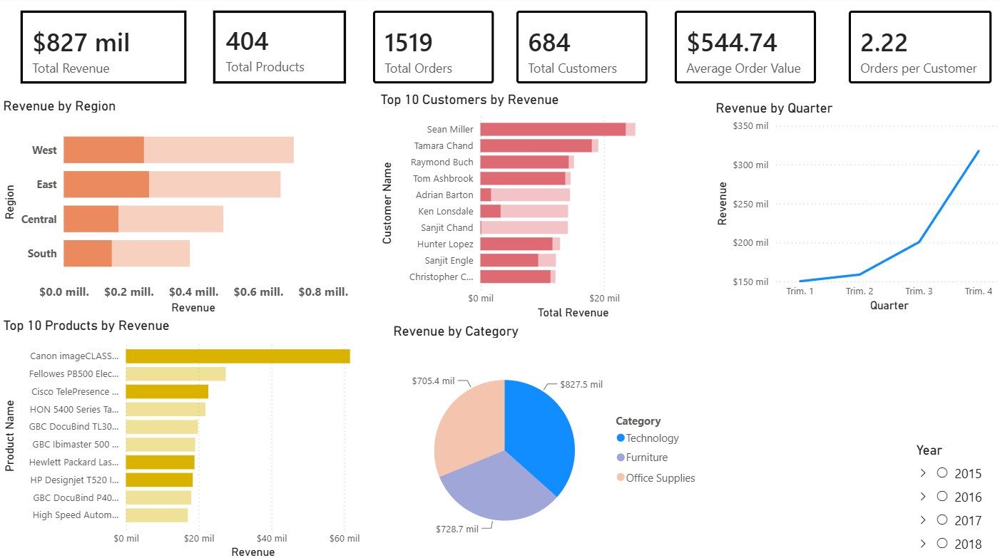

# 📊 Superstore Sales Performance Analysis

## Project Overview

This project analyzes historical sales data from a retail Superstore using **Google BigQuery (SQL)** and **Power BI**. The objective was to transform raw transactional data into meaningful business insights through data cleaning, KPI calculation, trend analysis, and interactive dashboards.

---

## Business Problem

Retail companies generate thousands of transactions every day. Without proper analysis, it is difficult to identify sales trends, top-performing products, customer behavior, and business opportunities.

This project answers questions such as:

- Which regions generate the highest revenue?
- Which product categories perform the best?
- How do sales change over time?
- Who are the most valuable customers?
- What KPIs should managers monitor?

---

## Objectives

- Clean and validate the dataset.
- Analyze sales performance using SQL.
- Calculate key business KPIs.
- Build an interactive Power BI dashboard.
- Provide actionable business recommendations.

---

## Tools Used

- Google BigQuery
- SQL (GoogleSQL)
- Power BI
- Microsoft Excel

---

## Dataset

**Source:** Superstore Sales Dataset

The dataset contains transactional information including:

- Orders
- Customers
- Products
- Categories
- Regions
- States
- Sales
- Shipping Information

---

## Repository Structure

```text
sales-analysis-dashboard
│
├── data/
├── sql/
├── dashboard/
├── presentation/
├── images/
└── README.md
```

---

## Data Preparation

The dataset was validated before analysis.

Tasks performed:

- Data quality validation
- Missing value review
- Duplicate detection
- Date validation
- Shipping time calculation
- Sales distribution analysis

---

## SQL Analysis

More than **25 SQL queries** were developed using Google BigQuery.

Topics covered:

- Data exploration
- Data quality
- Business KPIs
- Sales trends
- Customer analysis
- Product analysis
- Geographic analysis
- Shipping analysis

Advanced SQL concepts:

- CTEs
- Window Functions
- CASE
- LAG
- RANK
- ROW_NUMBER
- NTILE
- QUALIFY
- HAVING

---

## Dashboard

The interactive dashboard includes:

- Executive KPIs
- Sales by Region
- Sales by Category
- Sales by Segment
- Monthly Sales Trend
- Top Customers
- Top Products

---

## Dashboard Preview





---

## Key Insights

- Strong sales seasonality during the last quarter of the year.
- Consumer segment generated the highest revenue.
- Technology was the highest-performing category.
- Revenue was concentrated among a relatively small number of customers.
- Some regions consistently outperformed others.

---

## Business Recommendations

- Increase inventory before peak sales months.
- Prioritize marketing investment in high-performing categories.
- Develop loyalty strategies for high-value customers.
- Improve performance in underperforming regions.
- Continuously monitor shipping performance.

---

## Repository Contents

| Folder | Description |
|---------|-------------|
| data | Original dataset |
| sql | SQL queries |
| dashboard | Power BI dashboard |
| presentation | Final presentation |
| images | Dashboard screenshots |

---

## Author

**Luis Adrian Gamez Saucedo**

Industrial Engineer | Data Analyst

### Skills

- SQL
- Google BigQuery
- Power BI
- Excel
- Business Intelligence
- Data Analysis
